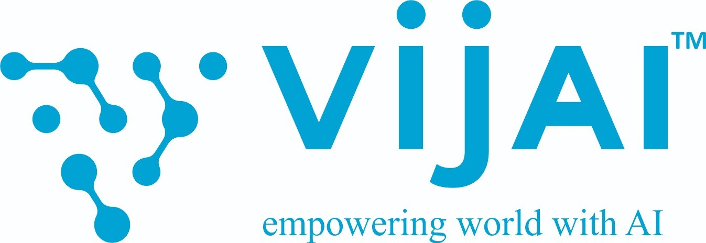

# Fabric Detection Model

<p align="center">
<!-- Here goes the logo-->
  
</p>

<p align="center">
<!--Here come the badges-->
  
  
  
  
  
  
  
  
  
  
</p>

<!-- AWS Deployment Badges -->
  

This project is an end-to-end implementation of a **Fabric Detection Model** designed to classify corduroy and denim fabrics using machine learning techniques. The project consists of multiple stages, from data ingestion to final prediction, with both training and deployment pipelines.

------------------------- 
----------

##  📌 Key Features of This Project

- **Diverse Feature Extraction Methods**: Use of multiple feature extraction techniques to capture the distinct patterns of corduroy and denim fabrics.
- **Handling Image Variations**: We incorporate image augmentation techniques to make the model resilient to real-world variations
- **In-Memory Processing** - The model processes the images completely in-memory during prediction, avoiding the storage of unnecessary artifacts providing faster predictions and reducing memory overhead.
- **Nested Cross-Validation** - Evaluate model performance rigorously across multiple validation sets, ensuring high reliability in detecting corduroy and denim fabrics.
- **Efficient Error Handling & Logging** - A robust logging and error handling system to debug & resolve errors quickly.
- **Modular Code Structure**: Well-organized codebase with clear separation of concerns ensures updates are be applied to specific parts of the system without affecting the entire codebase, increasing maintainability.
- **Web Application**: User-friendly interface for real-time fabric detection, with image upload functionality.
- **Scalability with Cloud Integration**: The model is integrated with AWS Elastic Beanstalk for deployment and Amazon S3 for storage.


## 📌 Pipelines in the Project

The **Fabric Detection Model** leverages image processing and machine learning algorithms to identify fabrics from images. The project is divided into two major pipelines:

1. **Training Pipeline** - For training the machine learning model on labeled fabric images.

     i. **Nested Cross Validation Pipeline**: Performs nested cross validation with RandomizedSearchCV to select the best model hyperparameters an evaluate the model performance through nested cross validation.

   ii. **Final Training Pipeline**: Trains the best selected model through nested cross validation pipeline on the entire training data.
   
3. **Deployment Pipeline** - For deploying the trained model and using it for predictions on new data. The deployment pipelne has been configured to be used on AWS Cloud.


## 𓇗 Branches in the Repository

1. `main` branch: Contains the production ready code to be deployed in AWS ElasticBeanstalk environment.
2. `laptop_notebooks_branch` : All the prototyping Jupyter notebooks made and tested on our local machine.
3. `colab_notebooks_branch`: All the prototyping Google Colab notebooks made & tested on Google Colaboratory Pro due to compute resource limitation on our local machine.
4. `development_branch`: Contains all the integrated changes after experimentation. Finally merged into `main` branch.
5. ` final_train_pipeline`: Feature branch of development_branch. Contains the finalized code for the Training Pipeline. This branch is merged into `development_branch`.
6. `deployment_pipeline`: Feature branch of development_branch. Contains the finalized code for Deployment Pipeline but not configured for AWS cloud. This branch is not merged into `development_branch`.
7. `ebs_deployment`: Feature branch of `deployment_pipeline` to integrate AWS configurations for deployment.
   This branch is merged into `development_branch` .

   **_Note: For branch specific details refer to the README.md of the respective branch_**


## 🔍 Literature Review

**Detailed literature review for our project can be found at [Literature Review Wiki](https://github.com/Parthsarthi-lab/Fabric_Detection/wiki/Literature-Review)**


## 📄 Full Documentation

**To learn more about the Project(Literature Review, Project Workflow) refer to our project's [Wiki](https://github.com/Parthsarthi-lab/Fabric_Detection/wiki).**
## 🚀 Installation Instructions

- Python 3.12+
- Virtual environment (recommended)
- Git

1. **Clone the Repository**:
    ```bash
    https://github.com/Parthsarthi-lab/Fabric_Detection.git
    cd Fabric_Detection
    git checkout final_train_pipeline
    ```

2. **Setting up a virtual environment**
    ```bash
    conda create -p fabric_venv   # Create a conda virtual environment
    conda activate path/to/your_project/fabric_venv
    ```

3. **Install Dependencies**:
    ```bash
    pip install -r requirements.txt
    ```

## ⚙️ Executing the Training Pipeline

To train the model, execute the following commands:

1. **Execute the nested cross validation pipeline:**
```bash
python execute_cross_validation.py
```

2. **Execute the final model training:**
```bash
python execute_final_model_training.py
```


## ⚙️ Executing the Deployment Pipeline

i. **On Cloud**: If you want to deploy the model on cloud refer to our [Deployment Wiki](https://github.com/Parthsarthi-lab/Fabric_Detection/wiki/Deployment).

   ii. **On Local Machine**: If you want to execute the deployment pipeline to create a Flask web application locally refer to our [Deployment Branch](https://github.com/Parthsarthi-lab/Fabric_Detection/tree/deployment_pipeline). 


